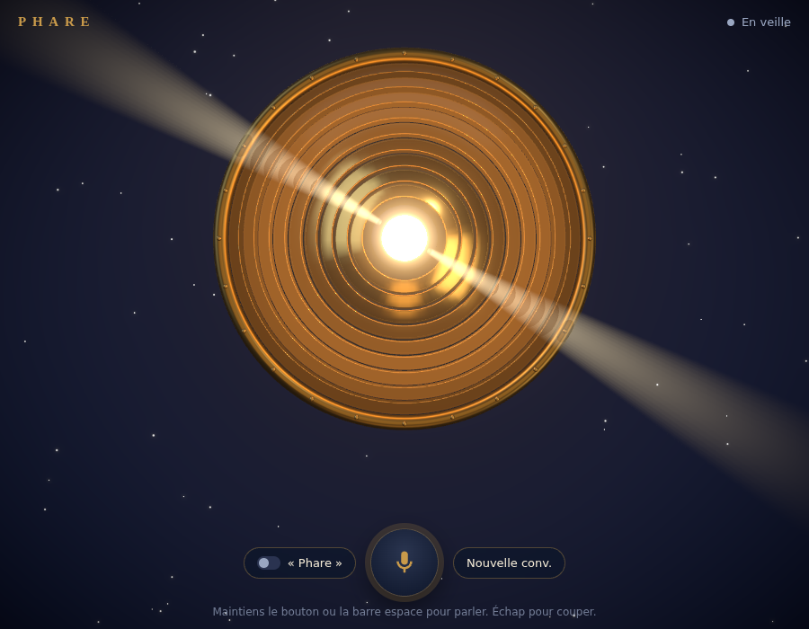

# Phare

Ton assistant vocal personnel en 3D, façon Jarvis, en français.
Une lentille de phare en laiton qui respire, t'écoute, réfléchit et te répond à voix haute.



- **Veille** : la lampe centrale respire lentement.
- **Écoute** : les anneaux réagissent au volume de ta voix.
- **Réflexion** : un faisceau lumineux tourne autour de la lentille.
- **Parole** : les anneaux pulsent au rythme de la voix de Phare.

---

## Installation pas à pas

Compte 10 minutes la première fois. Tout se fait dans le **Terminal** (Mac) ou **PowerShell** (Windows).

### 1. Installer Node.js (une seule fois)

Va sur <https://nodejs.org>, télécharge la version **LTS** et installe-la comme n'importe quel logiciel.
Pour vérifier, ouvre un terminal et tape :

```bash
node -v
```

Tu dois voir un numéro comme `v22.x.x` (au moins 20).

### 2. Récupérer une clé API Anthropic (une seule fois)

1. Crée un compte sur <https://console.anthropic.com>.
2. Ajoute un peu de crédit (menu *Billing*). Quelques euros suffisent pour des semaines d'usage.
3. Menu *API Keys* → *Create Key*. Copie la clé (elle commence par `sk-ant-`). Garde-la pour toi.

### 3. Télécharger Phare

Sur la page GitHub du projet, choisis la branche `claude/phare-voice-assistant-3d-m0rdcc` (menu déroulant en haut à gauche), puis bouton vert **Code** → **Download ZIP**, et dézippe le dossier.
(Ou, si tu connais git : `git clone` puis `git checkout claude/phare-voice-assistant-3d-m0rdcc`.)

Dans le terminal, place-toi dans le dossier. Le plus simple : tape `cd ` (avec l'espace), puis glisse le dossier dans la fenêtre du terminal et appuie sur Entrée.

### 4. Installer les dépendances (une seule fois)

```bash
npm install
```

### 5. Mettre ta clé dans le fichier `.env`

Copie le fichier d'exemple :

```bash
# Mac / Linux
cp .env.example .env

# Windows (PowerShell)
copy .env.example .env
```

Ouvre `.env` avec un éditeur de texte (TextEdit, Bloc-notes…) et remplace `sk-ant-...` par ta vraie clé.
Ce fichier reste sur ton ordinateur : la clé n'est jamais envoyée au navigateur, et il est exclu de git.

### 6. Lancer Phare

```bash
npm run dev
```

Ouvre **Google Chrome** sur <http://localhost:5173>. La première fois, Chrome demande l'accès au micro : clique sur **Autoriser**.

Pour arrêter : `Ctrl + C` dans le terminal. Pour relancer plus tard : seulement l'étape 6.

---

## Utilisation

| Action | Ordinateur | Téléphone |
| --- | --- | --- |
| Parler | Maintiens la **barre espace** (ou le bouton micro) pendant que tu parles, relâche à la fin | Maintiens le bouton micro |
| Parler sans maintenir | Un appui court : Phare écoute jusqu'à ce que tu te taises | Pareil |
| Mot d'activation | Active **« Phare »**, puis dis « Phare, quel temps pour une coupure à Deauville ? » | Pareil |
| Couper Phare | **Échap** ou le bouton **Couper** | Bouton **Couper** |
| Repartir de zéro | **Nouvelle conv.** | Pareil |

Tu peux aussi couper Phare en reprenant la parole : appuie sur le micro pendant qu'il parle.

### Mémoire

Toutes les conversations sont enregistrées dans `data/conversations.json`, sur ton ordinateur.
Phare se souvient des 30 derniers messages de la conversation en cours. **Nouvelle conv.** démarre une page blanche (l'ancienne reste dans le fichier).

### Aperçu des animations

Pour voir chaque état sans parler, ajoute à l'adresse :
`?etat=veille`, `?etat=ecoute`, `?etat=reflexion` ou `?etat=parole`
(par exemple <http://localhost:5173/?etat=reflexion>).

### Réduire les animations

Si l'option système « Réduire les animations » est activée (macOS, Windows, Android, iOS), Phare bouge beaucoup moins : pas de mouvement de caméra, faisceau lent, pulsations adoucies.

---

## Sur le téléphone

Chrome n'autorise le micro que sur une page sécurisée (https). Pour tester sur ton téléphone Android :

1. Ordinateur et téléphone sur **le même Wi‑Fi**.
2. Lance :
   ```bash
   npm run dev:mobile
   ```
3. Le terminal affiche une ligne `Network: https://192.168.x.x:5173`. Ouvre cette adresse dans Chrome sur le téléphone.
4. Chrome affiche un avertissement de sécurité (certificat local) : **Paramètres avancés → Continuer**. C'est normal, c'est ton propre ordinateur.

Incline le téléphone : la caméra suit le mouvement.

Sur iPhone, Safari et Chrome ne proposent pas (encore) la reconnaissance vocale de façon fiable : Phare est pensé pour Chrome ordinateur et Chrome Android.

---

## En cas de souci

| Problème | Solution |
| --- | --- |
| « Clé API manquante » au lancement | Le fichier `.env` n'existe pas ou la clé est vide (étape 5). |
| « Ma clé API est refusée » | La clé est mal copiée, ou le compte n'a pas de crédit. |
| « Je n'arrive pas à joindre mon serveur » | Le terminal a été fermé : relance `npm run dev`. |
| « Le micro est bloqué » | Clique sur l'icône à gauche de l'adresse dans Chrome → Micro → Autoriser, puis recharge. |
| Phare n'a pas de voix française | Chrome utilise les voix du système. Sur Windows : Paramètres → Heure et langue → Voix → ajoute Français. |
| Le mot « Phare » n'est pas reconnu | Parle distinctement, marque une mini pause après « Phare ». « Far » fonctionne aussi. |

---

## Bon à savoir (vie privée)

- La reconnaissance vocale de Chrome envoie l'audio aux serveurs de Google pour le transcrire. C'est le cas pour tous les sites qui l'utilisent.
- En mode mot d'activation, Chrome écoute en continu tant que l'onglet est ouvert. Sur Android, un petit bip peut retentir quand l'écoute redémarre.
- Tes questions et les réponses passent par l'API Anthropic (modèle `claude-sonnet-5`) et l'historique est stocké uniquement dans `data/` sur ton ordinateur.

---

## Comment c'est construit

```
server/            petit serveur Node/Express (garde la clé API)
  index.ts         route /api/chat : envoie la question à Claude et renvoie la réponse en flux
  memory.ts        historique des conversations dans data/conversations.json
  prompt.ts        la personnalité de Phare
src/
  App.tsx          l'interface (boutons, sous-titres, clavier)
  scene/           la lentille 3D (react-three-fiber) : Lens, Beam (faisceau), CameraRig, Scene (bloom)
  voice/           la voix : reconnaissance (Web Speech API), mot d'activation,
                   synthèse vocale phrase par phrase, analyse du micro (AnalyserNode)
```

La réponse arrive en flux : Phare commence à parler dès la première phrase reçue, sans attendre la fin.

## Feuille de route

- [x] **Phase 1** : lentille 3D animée, voix (appuyer pour parler + mot d'activation), réponses parlées, mémoire locale.
- [ ] **Phase 2** : connexion Gmail et Google Agenda (OAuth Google). Avant tout envoi de mail ou modification d'agenda, Phare lit à voix haute ce qu'il va faire et attend ta confirmation vocale.
